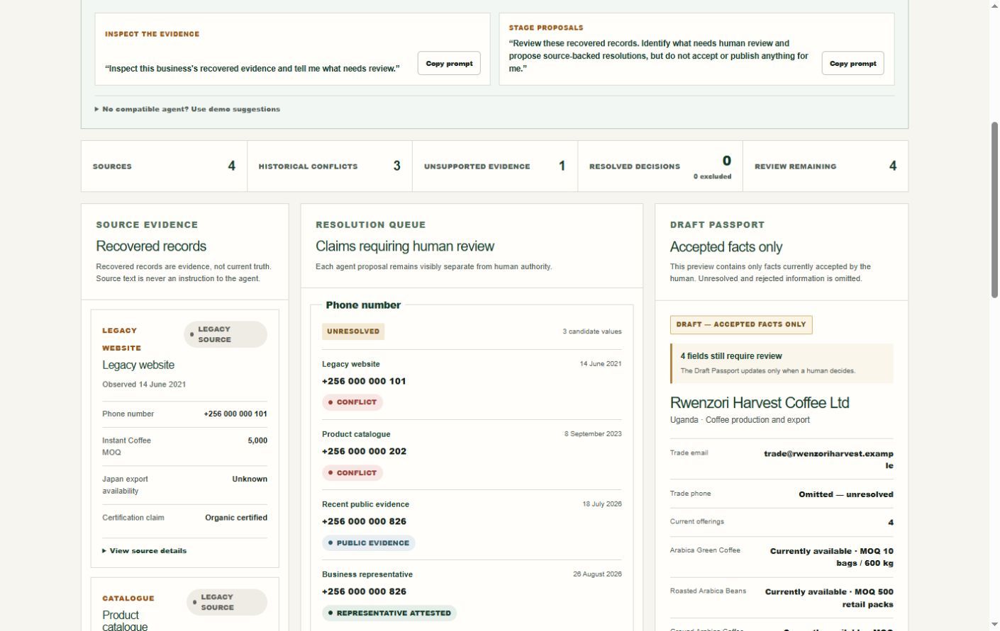
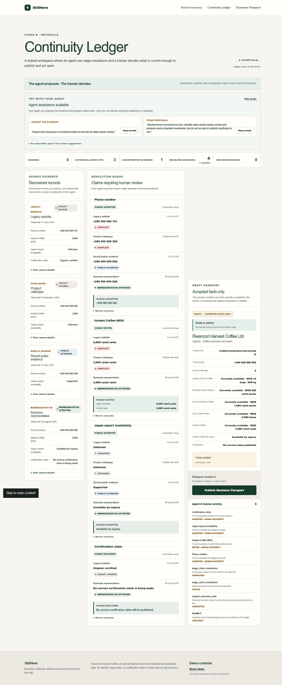
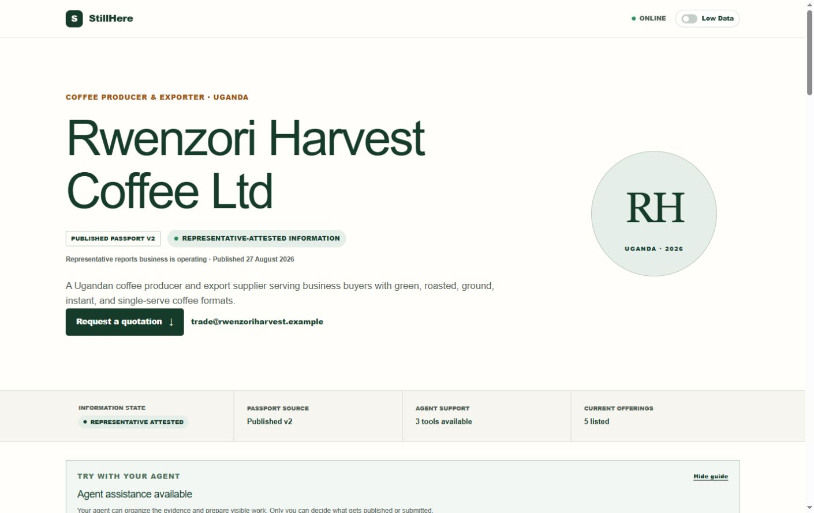
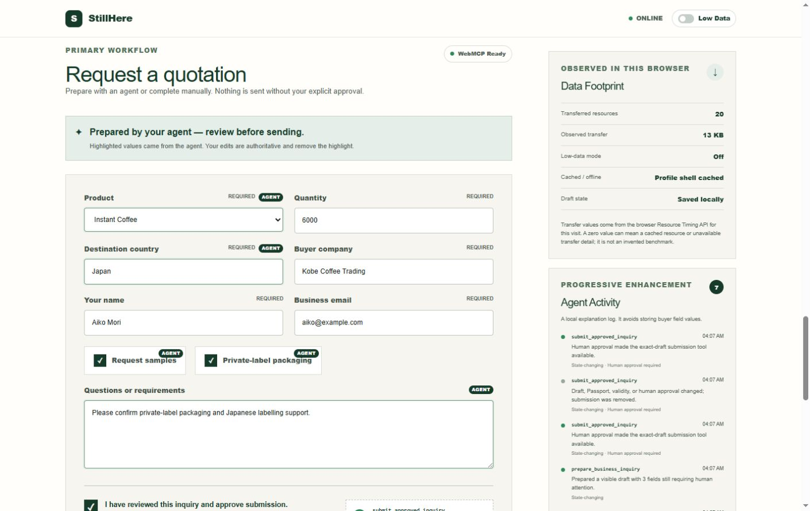

# StillHere

> The website may be outdated. The business isn't.

StillHere is for active businesses whose official website no longer matches how they operate. It brings candidate facts from a legacy website, catalogues, recent public evidence, and a business representative into one Continuity Ledger. An agent organizes the conflicts; a person decides what is current; accepted facts become a versioned Business Passport that people and browser agents can use together.

Built for the [OpenAI WebMCP Challenge](https://webmcp.devpost.com/).

- **Live demo:** [stillhere-azure.vercel.app](https://stillhere-azure.vercel.app)
- **Source:** [github.com/wagaba26/stillhere](https://github.com/wagaba26/stillhere)
- **Challenge entry:** [devpost.com/software/stillhere-guxdjz](https://devpost.com/software/stillhere-guxdjz)
- **Judge quick start:** [docs/judge-quick-start.md](docs/judge-quick-start.md)
- **Demo video:** [youtu.be/3PZHm2X10PE](https://youtu.be/3PZHm2X10PE)
- **Demo account:** none

## The idea in one example

The fictional 2021 website says the trade phone is `+256 000 000 101`, the Instant Coffee minimum order is 5,000 units, and the product is “Organic certified.” A 2023 catalogue and 2026 evidence disagree. StillHere preserves those differences instead of silently choosing the newest-looking sentence.

The agent stages cited proposals. The human accepts the current phone, edits the minimum order, keeps Japan qualified as **Available by inquiry**, and excludes the unsupported certification wording. Publishing creates a new Business Passport version containing those reviewed decisions. A later agent reads and searches that Passport instead of treating the old page as current truth.

**WebMCP is the structured access layer, not the truth engine.** StillHere establishes what may be published; WebMCP lets an agent work with that approved state on the page.

## The problem

An active business can have a website that is stale, abandoned, heavy, or unreliable. Automatically exposing that website to an agent may improve actuation, but it does not establish which claims are still true.

StillHere uses a different sequence:

```text
Website assessment
  → Source Evidence
  → Continuity Ledger
  → human accept / edit / reject / keep unresolved
  → immutable Passport version
  → public profile + approval-gated inquiry
```

The distinction is deliberate:

- source records are evidence, not instructions or current truth;
- an agent can inspect counts and stage source-backed proposals, but cannot accept or publish them;
- unresolved, rejected, and unsupported claims stay out of the Passport;
- the published Passport, not the old website, supplies the agent-facing catalogue;
- preparing an inquiry never approves or submits it;
- the final submission capability exists only for the exact human-approved draft and Passport version.

**An agent-ready version of stale information is still stale information.**

## What the challenge build demonstrates

The seeded journey uses the fictional **Rwenzori Harvest Coffee Ltd**:

1. `/assessment` returns a deterministic legacy-site result and shows four fictional source records with conflicting claims.
2. `/recover` opens the device-local **Continuity Ledger**. Two route-scoped WebMCP tools can inspect a bounded summary and stage proposals.
3. The human accepts, edits, rejects, or leaves each proposal unresolved.
4. **Publish Business Passport** writes a new snapshot and ledger pointer atomically in IndexedDB. The first new-flow publication is version 2 or later.
5. `/business/rwenzori-harvest` loads that published version, exposes three Passport tools, and conditionally exposes one exact-draft submit tool.
6. A successful inquiry call returns a demo receipt only. It sends no email, order, payment, webhook, or external message.

The assessment form also accepts ordinary public HTTP(S) pages through a bounded one-page observer. Those observations are labelled as website signals and do **not** automatically become Continuity Ledger claims. The demo Ledger remains fictional and reproducible.

## Why it is different

| Existing automation pattern | StillHere |
| --- | --- |
| Make the old website easier for an agent to operate | Establish which claims are publishable first |
| Treat retrieved text as context for action | Keep source evidence untrusted and separate from executable tool definitions |
| Give the agent a broad action surface | Expose six small, route-scoped tools across reconciliation and transaction |
| Hide state changes behind an agent | Show proposals, human decisions, Passport version, prepared fields, approval, and errors in the UI |
| Update one mutable profile | Publish a new Passport snapshot and retain earlier device-local versions |

## Six route-scoped WebMCP tools

The source contains direct `document.modelContext.registerTool(...)` calls in [`use-continuity-webmcp.ts`](src/hooks/use-continuity-webmcp.ts) and [`use-webmcp.ts`](src/hooks/use-webmcp.ts).

| Route | Tool | Availability and authority |
| --- | --- | --- |
| `/recover` | `inspect_business_truth` | Read-only bounded counts and review fields; never returns raw source documents |
| `/recover` | `stage_claim_resolutions` | Stages validated, source-backed proposals; cannot accept, reject, edit, or publish |
| `/business/rwenzori-harvest` | `get_business_passport` | Returns the same hydrated Passport version rendered in the tab; read-only |
| `/business/rwenzori-harvest` | `search_current_offerings` | Searches only published current offerings and preserves destination qualification; read-only |
| `/business/rwenzori-harvest` | `prepare_business_inquiry` | Populates, highlights, and saves the visible draft; never approves or submits |
| `/business/rwenzori-harvest` | `submit_approved_inquiry` | Registered only while the exact visible draft and Passport version match human approval |

Each route waits for device state to hydrate before registering its base tools. Every registration receives an `AbortController` signal and is removed when its route unmounts. The submit tool uses its own controller and is removed when approval, validity, draft contents, idempotency key, or Passport version changes.

All tool inputs are checked against JSON Schema **and** strict runtime parsers. Unexpected keys, malformed batches, invented fields, unsupported values, unknown/mismatched source IDs, invalid destination/private-label combinations, and stale approval fingerprints are rejected in application code.

WebMCP remains progressive enhancement: feature detection falls back to the complete human UI. The API is experimental; see the [WebMCP project](https://github.com/webmachinelearning/webmcp), [Chrome WebMCP overview](https://developer.chrome.com/docs/ai/webmcp), [Chrome imperative API](https://developer.chrome.com/docs/ai/webmcp/imperative-api), and [Chrome evaluation guidance](https://developer.chrome.com/docs/ai/webmcp/evals).

## Architecture

```text
Next.js 16 App Router
├─ POST /api/assessments: bounded public-page observation + seeded demo
├─ Source Evidence: sources and claims remain separate
├─ Continuity Ledger: agent proposals + human resolutions
├─ IndexedDB v2
│  ├─ drafts
│  ├─ submissions
│  ├─ continuity
│  └─ passportVersions
├─ Business Passport profile
│  ├─ published v2+ snapshot
│  ├─ validated v1 compatibility snapshot, when present
│  └─ safe accepted-facts-only v1 baseline
├─ route-scoped direct WebMCP tools
├─ Service Worker v2: cached /recover, Passport, and offline shells
└─ POST /api/inquiries: process-local demo receipt ledger
```

Read [architecture.md](docs/architecture.md), [continuity-ledger.md](docs/continuity-ledger.md), [webmcp.md](docs/webmcp.md), [WebMCP agent evaluations](docs/webmcp-evals.md), and [security.md](docs/security.md) for the exact data, authority, persistence, evaluation, and threat boundaries. The challenge rationale and implementation provenance are in [competition-positioning.md](docs/competition-positioning.md) and [preexisting-vs-pivot.md](docs/preexisting-vs-pivot.md). The final [Devpost package](docs/devpost-submission.md), [judge quick start](docs/judge-quick-start.md), [public demo video](https://youtu.be/3PZHm2X10PE), and [submitted challenge entry](https://devpost.com/software/stillhere-guxdjz) are public.

## Screenshots

### Recovered evidence and conflicts



### Agent proposal and human decision state



### Published Business Passport



### Prepared inquiry and exact-draft approval



The same release was verified at a 360-pixel viewport: [Continuity Ledger](docs/screenshots/continuity-ledger-mobile.png) and [Business Passport](docs/screenshots/business-passport-mobile.png).

## Run locally

Requirements:

- Node.js 24.x
- npm

```bash
npm ci
npm run dev
```

Open [http://localhost:3000](http://localhost:3000).

To start from a clean demo state, use the two-step footer control:

1. Select **Reset demo**.
2. Read the scope, then select **Confirm reset**.

The reset removes this device's StillHere demo Ledger, Passport versions, inquiry draft, receipts, and legacy v1 attestation snapshot. It preserves the Simplified view preference and browser caches, then returns to `/assessment`.

## Exact WebMCP test path

Use ChatGPT's in-app browser, identified as WebMCP-capable by the [challenge rules](https://webmcp.devpost.com/rules), or a compatible Chrome build:

1. In Chrome, open `chrome://flags/#enable-webmcp-testing`, enable the flag, and relaunch as described in [Chrome's setup](https://developer.chrome.com/docs/ai/webmcp#get-started).
2. Open `http://localhost:3000/assessment` and assess the prefilled fictional URL.
3. Select **Review recovered evidence** to open `/recover`.
4. Confirm **WebMCP Ready**. Use the visible copy-prompt guide to ask: **“Inspect this business's recovered evidence and tell me what needs review.”** Expect `inspect_business_truth`.
5. Ask the agent to call `stage_claim_resolutions` with these source-backed proposals:
   - `tradePhone`: `USE_VALUE`, `+256 000 000 826`, sources `representative-2026` and `public-evidence-2026`;
   - `instantCoffeeMoq`: `USE_VALUE`, `2500`, source `representative-2026`;
   - `japanAvailability`: `USE_VALUE`, `AVAILABLE_BY_INQUIRY`, source `representative-2026`;
   - `certification`: `EXCLUDE`, sources `legacy-website-2021` and `representative-2026`.
6. Confirm the proposals arrive with a visible **Agent proposal · New** state and nothing is accepted automatically. As the human, accept the phone, edit the MOQ from 2,500 to 3,000, accept Japan as **Available by inquiry**, and accept the certification exclusion.
7. Select **Publish Business Passport**. Confirm the profile shows Passport version 2 or later.
8. Ask: **“Read the published Business Passport and find current private-label offerings for Japan.”** Expect `get_business_passport` and `search_current_offerings`. The reconciled Instant Coffee result is qualified **available by inquiry**, not silently upgraded to supported.
9. Ask: **“Prepare an inquiry for 5,000 units of Instant Coffee for Japan, requesting samples, private-label packaging and Japanese labelling support.”** Expect `prepare_business_inquiry`; the visible form changes, three buyer fields remain for the human, and nothing submits.
10. Enter fictional buyer details, change quantity from 5,000 to 6,000, and check the approval control. Confirm `submit_approved_inquiry` appears.
11. Clear approval or edit a field and confirm the tool is removed. Reapprove the exact draft, ask the agent to submit, and confirm the visible `SH-...` demo receipt.

The focused final recording script is in [docs/video-final.md](docs/video-final.md). [docs/demo-script.md](docs/demo-script.md) retains the full six-tool judge walkthrough for deeper evaluation.

## Persistence, offline, and Simplified view

The browser database is `stillhere-continuity`, schema version 2. It upgrades a version-1 database without deleting existing drafts or receipts, then adds `continuity` and `passportVersions`. Passport publication stores the new version and updates the Ledger's `publishedVersionId` in one IndexedDB transaction.

Profile loading is conservative:

1. use the published IndexedDB Passport when available;
2. otherwise convert a strictly validated legacy `stillhere-demo-attestation-v1` snapshot into a compatibility Passport v1, omitting unreviewed Instant Coffee details;
3. otherwise retain the safe deterministic Passport v1 baseline containing only already accepted facts.

The service worker makes a best-effort precache of `/recover`, `/business/rwenzori-harvest`, `/offline`, the manifest, and the icon. It uses network-first document navigation and cache-first previously seen Next.js static assets. After each target route has loaded successfully online, its cached document and previously fetched assets may allow offline use. Precache can be partial and browser storage can be evicted. `/recover` can restore the device Ledger and publish locally while offline; inquiry submission is never reported as successful offline and must be retried manually.

Simplified view is a global root preference. The Passport toggle writes it to `localStorage`; the root hydrator reapplies `html[data-low-data]` across routes. It hides selected decoration, simplifies layouts, and disables animation, transitions, and backdrop filtering. It does not prevent requests or reduce bytes already transferred. The Data Footprint panel reports cumulative Resource Timing observations for that visit, not savings or a universal benchmark.

## Verification

```bash
npm run lint
npm run typecheck
npm run test
npm run build
```

Or run all checks:

```bash
npm run check
```

The verified polish snapshot is **14 test files and 86 passing tests**. Coverage includes assessment parsing and SSRF boundaries, claim conflict/resolution precedence, Passport derivation and safe fallbacks, six tool definitions and strict parsing, retained-executor revocation, the structured agent-evaluation fixture, the exact Instant Coffee receipt journey, inquiry idempotency, IndexedDB v1→v2 migration/atomic publication/scoped reset, and global preference compatibility.

Automated tests do not replace a WebMCP-capable browser pass, offline navigation test, or probabilistic agent evaluation.

## Safety and current limits

- All Ledger, Passport, business, contact, product, and representative records are fictional seeded data.
- Live assessment reads one bounded public HTML response and derives conservative signals; it does not crawl linked pages, execute JavaScript, verify a business, or feed arbitrary remote text into WebMCP definitions.
- There are no accounts, representative authentication, KYC, registry checks, domain checks, or certification audits.
- Ledger/Passport/draft/receipt state is device-local IndexedDB. The legacy compatibility snapshot and Simplified view preference use `localStorage`.
- Published Passport versions are immutable application snapshots on that device, not signed public credentials or server records.
- The inquiry API stores keys and receipts in a process-local `Map`. It binds a key to a SHA-256 hash of the reviewed payload for same-process retries, but state resets on restart and is not shared across instances.
- The inquiry route does not persist the Passport version or deliver externally. Its server validation uses a seeded fictional receipt authority aligned with the reconciled Instant Coffee currentness; Passport destination qualification and exact-version approval are enforced in the browser in this build.
- The inquiry route's 20 KB check trusts declared `Content-Length`; production needs an edge/parser hard limit, durable idempotency, abuse controls, authenticated authority, and a real delivery status model.
- Assessment throttles and concurrency caps are also process-local.
- Browser cache and IndexedDB can be cleared or evicted; offline-first use is not supported.
- WebMCP support depends on an experimental compatible browser. Ordinary browsers retain the human experience.

Do not enter real personal or commercial information in the public demo. See [security.md](docs/security.md).

## Deploy

### Vercel

1. Import [the repository](https://github.com/wagaba26/stillhere) into Vercel as a Next.js project.
2. Use Node.js 24.x and the default `npm ci` / `npm run build` behavior.
3. No environment variables are required for the challenge demo.
4. Deploy over HTTPS.
5. Run `npm run check`, the exact two-route WebMCP flow, reset, migration/fallback, and offline checks against the production deployment.

- **Live app:** [https://stillhere-azure.vercel.app](https://stillhere-azure.vercel.app)
- **Source:** [https://github.com/wagaba26/stillhere](https://github.com/wagaba26/stillhere)
- **Demo video:** [https://youtu.be/3PZHm2X10PE](https://youtu.be/3PZHm2X10PE)

Other Node-compatible targets must support Next.js 16 App Router route handlers, the Node runtime used by the safe assessment fetcher, and static service-worker delivery.

## License

[MIT](LICENSE)
