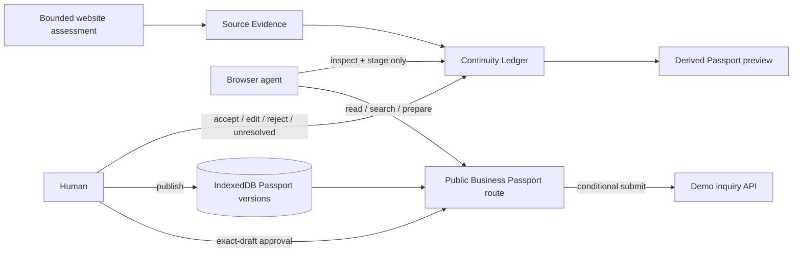

# Architecture

StillHere is a Next.js application whose main trust boundary is the browser tab. Source evidence, agent proposals, human resolutions, published Passport versions, and the inquiry draft remain distinct objects rather than one mutable “business profile.” WebMCP augments the same visible routes and state a human uses; there is no separate MCP server.

## End-to-end flow

The public-URL assessment and the seeded continuity demo are deliberately separate. A live page observation produces bounded website signals, not trusted Ledger claims. The fictional seeded path supplies the Source Evidence and Continuity Ledger used for the challenge narrative.

## Layers

| Layer | Main files | Responsibility |
| --- | --- | --- |
| Routes | `src/app/**` | Landing, assessment, Ledger, Passport profile, offline fallback, manifest, and two API routes |
| Assessment boundary | `src/app/api/assessments/route.ts`, `src/lib/safe-site-fetch.ts`, `src/domain/assessment.ts` | Bounded JSON request, public-only pinned network connection, one HTML response, and conservative page signals |
| Source and Ledger domain | `src/domain/types.ts`, `src/domain/continuity-demo.ts`, `src/domain/continuity.ts` | Evidence sources, claims, conflict/unsupported detection, proposals, human resolutions, and summaries |
| Passport domain | `src/domain/passport.ts` | Accepted-facts-only projection, destination qualification, search, v1 compatibility conversion, and version creation |
| Ledger UI/WebMCP | `src/app/recover/recovery-wizard.tsx`, `src/hooks/use-continuity-webmcp.ts`, `src/lib/continuity-webmcp.ts` | Visible evidence and resolution queue, two hydrated route tools, human decisions, live preview, and publication |
| Passport UI/WebMCP | `src/app/business/rwenzori-harvest/profile-experience.tsx`, `src/hooks/use-webmcp.ts`, `src/lib/passport-webmcp.ts` | Hydrated Passport, published catalogue, visible inquiry, three base tools, fingerprinted approval, and conditional submit |
| Persistence | `src/lib/indexed-db.ts`, `src/lib/preferences.ts` | IndexedDB v2 Ledger/Passport/draft/receipt state plus Low Data and legacy-attestation compatibility keys |
| Offline/global preferences | `public/sw.js`, `src/components/service-worker-registration.tsx`, `src/components/preference-hydrator.tsx` | Shell caching, navigation fallback, static-asset caching, and root Low Data hydration |
| Scoped demo reset | `src/components/demo-reset-control.tsx` | Two-step deletion of demo device state while preserving Low Data and browser caches |
| Demo receipt API | `src/app/api/inquiries/route.ts` | Seeded validation, payload-bound process-local idempotency, and fictional receipt response |

## Route map

| Route | Current behavior |
| --- | --- |
| `/` | Product thesis and Recover → Reconcile → Approve → Publish → Transact story |
| `/assessment` | Seeded challenge result or bounded observation of one supplied public HTML page |
| `/recover` | Source Evidence, Continuity Ledger, two WebMCP tools, human resolution queue, live Passport preview, and device-local publication |
| `/business/rwenzori-harvest` | Hydrated Passport version, three base tools, conditional submit tool, local draft, activity, footprint, and offline status |
| `/offline` | Generic cached-navigation fallback with a link to the Passport route |
| `/api/assessments` | Same-origin JSON endpoint for seeded or bounded public-page observation |
| `/api/inquiries` | Process-local fictional receipt endpoint |
| `/manifest.webmanifest` | Next.js-generated PWA manifest |
| `/sw.js` | Service worker v2 |

## Source Evidence and Continuity Ledger

The seeded demo has four source types:

- legacy website;
- later catalogue;
- recent public evidence;
- fictional business representative.

Each `BusinessClaim` points to one source and one typed continuity field. Evidence states remain explicit: `OWNER_CONFIRMED`, `PUBLIC_EVIDENCE`, `LEGACY_SOURCE`, `CONFLICT`, or `UNKNOWN`.

Most stable fields begin with earlier human-accepted seed resolutions. Four deliberate review scenarios remain open:

1. trade phone;
2. Instant Coffee MOQ;
3. Japan availability for Instant Coffee;
4. an unsupported legacy certification claim.

Agent proposals use `AGENT_PROPOSED`. A human can produce `HUMAN_ACCEPTED`, `HUMAN_EDITED`, `HUMAN_REJECTED`, or explicitly return a proposal to `UNRESOLVED`. Staging a later proposal does not overwrite an earlier human decision. The Passport projection selects the latest accepted/edited human resolution and ignores agent-only, rejected, and unresolved states.

Proposal validation requires:

- one of the four reviewable fields;
- `USE_VALUE`, except certification may only be proposed as `EXCLUDE`;
- a field-appropriate bounded value;
- one to four unique source IDs;
- every source to exist and carry a claim for that field;
- a `USE_VALUE` proposal to exactly match a value found in a cited source;
- a nonempty explanation of at most 320 characters;
- a batch of one to six proposals with no duplicate field and no already-pending field.

The agent cannot accept, edit, reject, mark unresolved, or publish through WebMCP. Those actions exist only as visible human controls.

## Passport derivation and versioning

`derivePassport()` starts from human resolutions, not from the source documents. Stable offerings are cloned from the accepted resolution. Instant Coffee enters the Passport only when its current status, positive whole-number MOQ, and private-label flag have accepted values. Japan qualification is a separate destination status and remains absent until resolved. Certification is omitted when unresolved or excluded; the published product then states that no certification claim is published.

The preview may therefore be published even with unresolved fields: omission is the safety behavior. Publication is always a human button action.

`createPassportVersion()` deep-clones the derived Passport and assigns an incrementing version. The Ledger flow sets a minimum of version 2, distinguishing the new reconciled model from safe/legacy v1 snapshots. The app treats published version records as immutable snapshots and creates a new record for later publication.

`publishPassportVersion()` uses one IndexedDB transaction to:

1. write the new record to `passportVersions`;
2. write the Continuity Ledger with `publishedVersionId` pointing to that record and an updated timestamp.

## Safe v1 and legacy fallback

The Passport route initializes with a deterministic safe version 1 derived from the seeded Ledger's already accepted facts. It then checks device state in this order:

1. **Published:** load the Ledger's `publishedVersionId` and matching IndexedDB version.
2. **Compatibility:** if no published version exists, strictly parse `stillhere-demo-attestation-v1` from `localStorage` and convert it to Passport v1.
3. **Baseline:** if neither exists, or IndexedDB restoration fails, retain the safe deterministic v1 baseline.

The compatibility converter excludes Instant Coffee entirely because the old attestation format cannot represent the new field-level resolution authority. It only includes legacy contacts explicitly marked current and carries over the earlier identity, product-state, capability, market, and workflow selections.

Base Passport tools wait for both Passport and draft hydration, so an agent is not briefly offered an unconfirmed in-memory fallback before device storage is checked.

## IndexedDB schema version 2

Database: `stillhere-continuity`, version `2`.

| Store | Key | Contents |
| --- | --- | --- |
| `drafts` | `id` | The Rwenzori Harvest inquiry draft |
| `submissions` | `idempotencyKey` | Device-local demo receipts |
| `continuity` | `businessId` | Sources, claims, resolutions, current published pointer, update time |
| `passportVersions` | `id` | Versioned Passport snapshots; nonunique `businessId` index |

The v1→v2 upgrade creates missing `continuity` and `passportVersions` stores without deleting v1 drafts or receipts. Connections close on `versionchange`; a blocked upgrade rejects with an actionable error rather than silently continuing against an old schema.

Draft and Ledger changes use a 180 ms debounced save. Agent inquiry preparation saves before returning. Passport publication is the multi-store atomic operation described above.

## Inquiry authority and state flow

```mermaid
stateDiagram-v2
    [*] --> Hydrating
    Hydrating --> DraftLocal: Passport + draft checked
    DraftLocal --> DraftLocal: human or agent edit; device save
    DraftLocal --> Approved: valid + human approves exact fingerprint
    Approved --> DraftLocal: field, key, Passport, validity, or approval changes
    Approved --> Submitting: manual or conditional WebMCP submit
    Submitting --> Submitted: demo API receipt
    Submitting --> Pending: offline, network, or API failure
    Pending --> Submitting: visible manual retry
```

The authority fingerprint includes the Passport version ID, every visible inquiry field, and the idempotency key. Approval records that fingerprint. Submit registration and execution require it to equal the current fingerprint. `performSubmit()` repeats that comparison and Passport-aware client validation.

The client checks published product status, destination qualification (`SUPPORTED` or `AVAILABLE_BY_INQUIRY`), and private-label availability. A human edit removes the field's agent highlight, clears the receipt/error state, and revokes approval. Editing a submitted or pending draft also generates a new idempotency key.

The server route does not receive the Passport version/fingerprint; it revalidates against seeded demo product rules. This is a documented demo boundary, not end-to-end Passport authorization.

## Six WebMCP tools and lifecycle

The app defines six tools across two routes:

- `/recover`: two Ledger tools;
- Passport route: three base tools and one conditional submit tool.

Each route feature-detects `document.modelContext.registerTool` and waits for local state hydration. Route controllers unregister all route tools on navigation. The conditional submit controller is additionally aborted when the exact authority changes. Registered callbacks read current state through refs.

See [webmcp.md](webmcp.md) for schemas, validation, and exact tests.

## Offline and global Low Data

Service Worker v2 precaches:

- `/business/rwenzori-harvest`;
- `/recover`;
- `/offline`;
- `/manifest.webmanifest`;
- `/icon.svg`.

Document navigations are network-first with per-route cached fallback. Previously fetched `/_next/static/` assets are cache-first. API, cross-origin, non-GET, RSC, and router-prefetch requests are excluded. `Promise.allSettled` allows install to continue if one precache item fails, so an active worker is not proof that every resource is cached. The Passport UI explicitly checks whether its route response is present before showing profile availability.

The cached `/recover` shell can restore the Ledger from IndexedDB and publish a Passport locally after a prior successful online load. There is no Background Sync, and inquiry submission remains pending offline.

`PreferenceHydrator` runs in the root layout and applies the stored Low Data value to `html[data-low-data]` across routes. The visible toggle is on the Passport route. The preference hides selected decoration, simplifies layouts, and disables CSS motion/filter effects; it does not unload previously transferred resources.

## Scoped two-step reset

The footer reset requires **Reset demo** followed by **Confirm reset**. Its IndexedDB transaction deletes:

- the named demo inquiry draft;
- submission receipts in the demo store;
- the Rwenzori Harvest Continuity Ledger;
- only Passport versions whose `businessId` is `rwenzori-harvest`.

It then removes the legacy attestation compatibility key and navigates to `/assessment`. Low Data and Cache Storage are intentionally preserved. This is not a general origin-data wipe or server-state reset.

## API boundaries

### Assessment

`POST /api/assessments` accepts at most 4 KB of JSON, rejects cross-origin browser requests, enforces process-local per-address/concurrency limits, and either returns the seeded result or invokes the public-only safe fetcher. The fetcher uses standard ports, blocks reserved/private/mixed DNS results, pins a validated address, retains Host/TLS name verification, revalidates up to three redirects, enforces a nine-second total budget and 750 KB identity-encoded HTML limit, and does not execute or return source HTML.

### Inquiry

`POST /api/inquiries` requires an `Idempotency-Key` matching the draft, applies seeded inquiry validation, hashes the reviewed payload with SHA-256, returns the same in-process receipt for an exact retry, and rejects changed payload under a used key. New acceptance returns HTTP 202 and `Cache-Control: no-store`.

The receipt ledger is a process-local `Map`: restart or another instance loses it. It is not delivery, and the 20 KB protection depends on declared `Content-Length` rather than a hard streamed body limit.

## Production evolution

A real service needs authenticated representatives and organizations, durable source/resolution/Passport storage, signed or otherwise verifiable Passport provenance, globally constrained idempotency, server-side Passport-version authority, retention/deletion policy, edge abuse controls, observability, and a verified external delivery adapter with honest queued/delivered/failed states.
