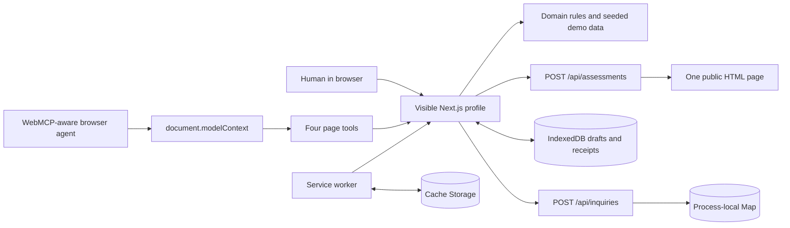

# Architecture

StillHere is a deliberately small Next.js application. Its central architectural decision is to keep the human interface, browser-agent tools, validation rules, and local continuity state in the same browser session. WebMCP augments the page; it is not a separate backend product.

## System view

There is no account system, external crawler, MCP server, durable database, message queue, email provider, payment service, or third-party analytics integration.

## Application layers

| Layer | Main files | Responsibility |
| --- | --- | --- |
| Routes and layout | `src/app/**` | Landing, bounded assessment, recovery wizard, profile, offline fallback, manifest, and APIs |
| Visible profile state | `src/app/business/rwenzori-harvest/profile-experience.tsx` | Inquiry form, approval, status, retry, activity, low-data control, and online/offline UI |
| WebMCP adapter | `src/hooks/use-webmcp.ts`, `src/lib/webmcp.ts` | Feature detection, input parsing, direct tool registration, tool lifecycle, and callbacks into the visible profile |
| Domain | `src/domain/**` | Seeded company/product data, evidence states, current-offering filters, inquiry validation, stable references, and in-memory ledger tests |
| Device persistence | `src/lib/indexed-db.ts`, `src/lib/preferences.ts` | IndexedDB draft/receipt storage, device-local attestation and low-data preferences, and browser resource measurement |
| Offline shell | `public/sw.js`, `src/components/service-worker-registration.tsx` | Service-worker registration, network-first profile navigation fallback, and cache-first Next static assets |
| Public-page observer | `src/app/api/assessments/route.ts`, `src/lib/safe-site-fetch.ts`, `src/domain/assessment.ts` | Bounded request handling, SSRF controls, pinned public connection, and conservative signal extraction |
| Demo intake route | `src/app/api/inquiries/route.ts` | Same-origin request validation and process-local idempotent demo receipts |

## Route map

| Route | Rendering/behavior |
| --- | --- |
| `/` | Product thesis, assess/recover/publish story, comparison, and demo CTA |
| `/assessment` | Deterministic fictional target or bounded observation of one supplied public HTML page |
| `/recover` | Six-step client-side Information Attestation flow that saves a fictional local snapshot |
| `/business/rwenzori-harvest` | Public continuity profile, WebMCP registration, inquiry collaboration, local persistence, and diagnostics |
| `/offline` | Cacheable navigation fallback explaining offline boundaries |
| `/api/inquiries` | `POST` route returning an idempotent fictional receipt |
| `/api/assessments` | `POST` route validating and observing one public page without executing it |
| `/manifest.webmanifest` | Next.js-generated PWA manifest |
| `/sw.js` | Service worker served with explicit JavaScript, no-store, and CSP headers |

## Data and evidence model

`src/domain/demo-data.ts` is the only business catalogue source in this build. Every product carries a product status and evidence state. The evidence vocabulary is:

- `OWNER_CONFIRMED`
- `PUBLIC_EVIDENCE`
- `LEGACY_SOURCE`
- `CONFLICT`
- `UNKNOWN`

`searchCurrentOfferings()` exposes only products with status `CURRENTLY_AVAILABLE` and evidence `OWNER_CONFIRMED` or `PUBLIC_EVIDENCE`. The seasonal instant-coffee record may appear in the human catalogue with a seasonal label but is deliberately excluded from WebMCP “current offering” results and from the inquiry product selector.

“Attested” means only that a fictional representative confirmed the individual demo claim. It does not mean identity, legal entity, registry, domain, KYC, or certification verification.

The recovery wizard writes its reviewed fictional fields to `localStorage`. The profile overlays that snapshot on the seeded record, including identity, current contacts, product states, capabilities, markets, and primary workflow. This is single-browser demo publication, not an authenticated server record.

## Inquiry state flow

```mermaid
stateDiagram-v2
    [*] --> DraftLocal: hydrate/create draft
    DraftLocal --> DraftLocal: human or agent edits; IndexedDB save
    DraftLocal --> Approved: valid + human checks approval
    Approved --> DraftLocal: any field edit or approval cleared
    Approved --> Submitting: manual or WebMCP submit
    Submitting --> Submitted: API receipt + IndexedDB receipt
    Submitting --> Pending: offline/network/API failure
    Pending --> Submitting: human retry after reconnect
    Submitted --> DraftLocal: human edits; new key created
```

The profile keeps a single `InquiryDraft` as the source of truth. `prepare_business_inquiry` invokes the same `prepareInquiry()` function used by application logic, updates the visible React state, saves it to IndexedDB, scrolls to the form, and focuses the first control. Human edits remove that field's agent highlight and revoke approval.

The draft carries a generated idempotency key. The API derives a stable `SH-...` reference from it, checks header/body agreement, binds the accepted key to a SHA-256 hash of the reviewed payload, and returns the earlier in-process receipt only when a duplicate key carries the same payload. The browser also stores a successful receipt by key and returns it before another request from that device.

This is demonstration idempotency, not distributed idempotency: the API `Map` resets with the server process and is not shared across instances.

## WebMCP lifecycle

The profile feature-detects `document.modelContext.registerTool`. Unsupported browsers set a visible “human experience active” state and retain every manual capability.

The hook has two registration effects:

1. The base effect creates an `AbortController`, registers the three read/prepare tools with its signal, and aborts on unmount.
2. The submit effect runs only when both `approved` and `valid` are true. It registers `submit_approved_inquiry` with a fresh signal. React effect cleanup aborts that signal as soon as either dependency changes, unregistering the consequential tool.

Execution rechecks the latest state through refs/callbacks, so passing registration once is not treated as permanent authority. See [webmcp.md](webmcp.md).

## Offline and low-data design

The service worker precaches the profile route, offline route, manifest, and icon using `Promise.allSettled`. It ignores non-GET, cross-origin, API, React Server Component, and prefetch requests. It then:

- serves previously cached `/_next/static/` assets before the network;
- treats document navigation as network-first;
- caches successful profile/offline navigation responses;
- falls back to the cached profile for that route, otherwise the offline page.

The profile is therefore available offline only after a successful online installation/cache. A failed precache entry does not fail the whole service-worker install, so “profile ready” means the service worker is active, not a proof that every possible asset is permanently available. Cache and IndexedDB data remain subject to browser eviction.

Low Data mode persists in `localStorage`, applies an `html[data-low-data="true"]` rendering mode, hides decorative elements, simplifies layout, and removes animations/transitions/backdrop filters. It cannot recover bytes already transferred before the switch. Resource counts and bytes come from `performance.getEntriesByType("resource")`, with the UI explicitly explaining that zero may mean cached or unavailable timing details.

## API behavior

`POST /api/assessments` accepts a small JSON body containing one URL. The deterministic `.example` target returns seeded challenge data. Other inputs pass through protocol, credential, hostname, port and IP-range checks. DNS results must all be public, and the selected address is pinned into the HTTP/TLS connection while preserving the original Host header and TLS server name. Every redirect repeats the same validation. The route reads at most 750 KB of uncompressed HTML, follows at most three redirects, runs within a nine-second network budget, does not execute scripts or retrieve subresources, and returns only derived strings/numbers. Same-origin browser requests, a per-process request window, and a concurrency ceiling reduce casual abuse; durable distributed throttling remains future work.

The analyzer intentionally reports `Not attested`, zero confirmed-current products, and conservative limitations for public URLs. A year in page text, a contact link, or Product schema is an observation—not business verification.

`POST /api/inquiries`:

1. Rejects a declared `Content-Length` over 20,000 bytes.
2. Requires an `Idempotency-Key` of at most 160 characters.
3. Parses JSON.
4. Requires the header key to match `draft.idempotencyKey`.
5. Revalidates product, quantity, destination, buyer company/name, and email.
6. Returns an existing in-process receipt for a duplicate key.
7. Otherwise returns HTTP `202` with `{ receipt, duplicate: false, demo: true }` and `Cache-Control: no-store`.

No delivery occurs after acceptance.

## Production evolution

The current boundaries make the challenge story safe and reproducible. A real service would need, at minimum:

- authenticated representative roles and a traceable attestation workflow;
- a durable database and globally enforced idempotency constraint;
- retention, deletion, encryption, and access policies for buyer data;
- rate limiting, abuse controls, observability, and CSRF/origin review appropriate to the chosen authentication model;
- a real delivery adapter with explicit recipient verification and auditable status;
- durable edge rate limiting, egress monitoring and adversarial review for the public-page observer;
- independent accessibility, performance, security, and agent-evaluation passes.
