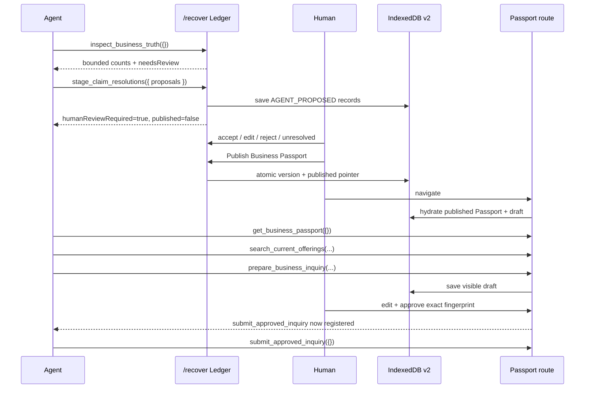

# WebMCP implementation

StillHere uses WebMCP's imperative browser API directly. Literal `document.modelContext.registerTool(...)` calls live in:

- `src/hooks/use-continuity-webmcp.ts` for the Continuity Ledger route;
- `src/hooks/use-webmcp.ts` for the Business Passport route.

Tool definitions and strict runtime parsing are separated into `src/lib/continuity-webmcp.ts` and `src/lib/passport-webmcp.ts`. There is no generated MCP server, wrapper framework, or agent-only backend.

WebMCP is an experimental proposed standard. The implementation follows the current [WebMCP project](https://github.com/webmachinelearning/webmcp), [Chrome overview](https://developer.chrome.com/docs/ai/webmcp), and [Chrome imperative API guide](https://developer.chrome.com/docs/ai/webmcp/imperative-api).

## Route scope and progressive enhancement

There are exactly six tool definitions, but they are never all active in one tab at once:

| Route | Initial tools | Conditional tool |
| --- | --- | --- |
| `/recover` | `inspect_business_truth`, `stage_claim_resolutions` | none |
| `/business/rwenzori-harvest` | `get_business_passport`, `search_current_offerings`, `prepare_business_inquiry` | `submit_approved_inquiry` |

Both hooks feature-detect `document.modelContext.registerTool`. If unsupported, the route reports `unsupported` and keeps the complete human workflow available.

Registration waits for device hydration:

- the Ledger waits until stored continuity state and version history have been checked;
- the profile waits until both the Passport and inquiry draft have been checked.

That prevents an agent from acting on a transient default while a different device-local authority is loading.

Each route creates an `AbortController` and passes its signal to every base registration. Navigating away aborts the controller and removes the tools. The profile creates a separate controller for submission; its cleanup also records a visible `removed` activity entry when an available tool loses authority.

## Ledger tools

### `inspect_business_truth`

- **Route:** `/recover`
- **Annotation:** `readOnlyHint: true`
- **Input:** exact empty object; unexpected keys are rejected
- **Output:** business name plus source, accepted-resolution, reviewed-decision, conflict, unresolved/omitted, review-remaining, unsupported-claim counts, fields needing review, and latest representative-attestation date
- **Privacy/scope:** derives the business name from the current accepted-facts Passport preview, but never returns recovered source documents or raw source text

The tool reads the latest Ledger through a ref and adds a metadata-only activity entry.

### `stage_claim_resolutions`

- **Route:** `/recover`
- **Annotation:** `readOnlyHint: false`
- **Input:** one to six proposal objects
- **Effect:** appends `AGENT_PROPOSED` resolutions to the visible Ledger and persists them locally
- **Non-authority:** cannot accept, edit, reject, mark unresolved, publish, or change an earlier human decision
- **Output:** staged proposal IDs/fields, `humanReviewRequired: true`, and `published: false`

Each proposal allows only:

| Field | Action | Value |
| --- | --- | --- |
| `tradePhone` | `USE_VALUE` | nonempty string, max 240 |
| `instantCoffeeMoq` | `USE_VALUE` | positive whole number, max 1,000,000 |
| `japanAvailability` | `USE_VALUE` | `SUPPORTED`, `AVAILABLE_BY_INQUIRY`, `UNSUPPORTED`, or `UNKNOWN` |
| `certification` | `EXCLUDE` | no `proposedValue` permitted |

Every proposal also requires one to four unique `supportingSourceIds` and an explanation of one to 320 characters.

## Passport base tools

### `get_business_passport`

- **Route:** `/business/rwenzori-harvest`
- **Annotation:** `readOnlyHint: true`
- **Input:** exact empty object
- **Authority:** the same hydrated `PassportVersion` rendered in the visible page
- **Output:** version/published time, accepted contact and capabilities, current offerings, representative-attestation wording, evidence wording, and fictional-data limitation

It does not scrape the page or return source evidence.

### `search_current_offerings`

- **Route:** Passport
- **Annotation:** `readOnlyHint: true`
- **Input:** optional `query` (120 characters), `destinationCountry` (80), `privateLabelRequired` (boolean), and whole-number `maxResults` (1–5)
- **Output:** Passport version, result count, and compact offering records

Search includes only `CURRENTLY_AVAILABLE` products. When a destination is supplied, products are eligible only for `SUPPORTED` or `AVAILABLE_BY_INQUIRY`; the returned `destinationStatus` preserves that distinction. Private-label filtering uses the published product value. Result count is both schema-bounded and runtime-validated.

### `prepare_business_inquiry`

- **Route:** Passport
- **Annotations:** `readOnlyHint: false`, `untrustedContentHint: true`
- **Required:** published `productId`, positive whole-number `quantity`, destination, `requestSamples`, and `privateLabel`
- **Optional:** buyer company/name/email and questions
- **Effect:** updates/highlights the visible form, saves the draft to IndexedDB before returning, scrolls/focuses the review UI, and reports validation/missing fields
- **Non-effect:** never approves or submits

Buyer identity fields are intentionally optional at the tool boundary so the agent can prepare the commercial request while the human supplies their identity in the visible form.

Before applying anything, runtime code verifies that the product is current in the hydrated Passport, the destination is supported or available by inquiry, the requested private-label option is published, any email is syntactically valid, and no extra keys are present.

## Conditional submission tool

### `submit_approved_inquiry`

- **Route:** Passport
- **Annotation:** `readOnlyHint: false`
- **Input:** exact empty object
- **Availability:** hydrated + valid + explicitly approved + approval fingerprint equals current fingerprint
- **Execution:** repeats every authority check, then calls the same submission function as the visible button

The fingerprint contains:

- Passport version ID;
- every visible inquiry field;
- idempotency key.

Any field edit, draft-key change, Passport-version change, invalidation, or approval removal changes eligibility. The submit effect aborts the old registration. Even a caller retaining the old executor fails because `execute()` reads and compares current authority again. `performSubmit()` independently repeats the fingerprint and Passport-aware inquiry validation.

Conceptually:

```ts
const submitEligible =
  hydrated &&
  approved &&
  valid &&
  approvalFingerprint === currentFingerprint;

useEffect(() => {
  if (!hasWebMcp() || !submitEligible) return;

  const controller = new AbortController();
  void document.modelContext!.registerTool(submitDefinition, {
    signal: controller.signal,
  });

  return () => controller.abort();
}, [submitEligible, currentFingerprint]);
```

## Strict runtime validation

JSON Schema helps an agent choose arguments; it is not treated as a security boundary. Runtime parsing also:

- rejects null, arrays, primitives, and unexpected object keys;
- rejects overlong strings rather than silently truncating them;
- requires finite numbers and whole numbers where specified;
- checks proposal field/action/value combinations;
- rejects duplicate proposal fields and fields with pending proposals;
- verifies every cited source exists and contains a claim for the proposed field;
- requires every `USE_VALUE` value to exist verbatim in a cited source;
- prevents the unsupported certification claim from being proposed as current;
- verifies Passport destination and private-label authority;
- rechecks exact-draft submission authority at execution.

Human-only metadata such as accepted/resolved state cannot be injected through the staging schema.

## Human/agent sequence



## Exact test procedure

### Browser setup

1. Use ChatGPT's in-app browser as described by the [challenge rules](https://webmcp.devpost.com/rules), or enable `chrome://flags/#enable-webmcp-testing` in a compatible Chrome build and relaunch.
2. Start the app with `npm run dev`.
3. Use the two-step footer reset to clear earlier demo Ledger/Passport/draft/receipt state.

### Ledger route

1. Open `/assessment`, assess the seeded fictional URL, and select **Review recovered evidence**.
2. On `/recover`, wait for **WebMCP Ready** and use the visible copy-prompt guide.
3. Confirm discovery shows `inspect_business_truth` and `stage_claim_resolutions`, not Passport tools.
4. Ask: **“Inspect the recovered business truth.”** Expect four sources, three conflicts, four fields needing review, and one unsupported claim in the seeded initial state.
5. Call `stage_claim_resolutions` with the four exact source-backed proposals listed in the README/demo script.
6. Confirm the visible queue changes but the Passport preview does not treat proposals as human decisions.
7. Attempt an extra key, unknown source, invented value, duplicated field, second pending proposal, or certification `USE_VALUE`; each must fail.
8. Use visible human controls to resolve the proposals, then publish Passport v2.

### Passport route

1. Confirm the route displays the published version and three base tools.
2. Call `get_business_passport` and verify the returned version equals the visible version.
3. Search `instant` with destination `Japan` and private label required; after the recommended v2 resolutions, expect Instant Coffee with `destinationStatus: "AVAILABLE_BY_INQUIRY"`.
4. Call `prepare_business_inquiry` for `instant-coffee-100g`, quantity `5000`, destination `Japan`, samples/private label true, requesting Japanese labelling support and leaving buyer identity fields absent.
5. Confirm the visible draft updates, missing buyer fields remain, and submission is absent.
6. Enter fictional buyer company/name/email and check approval. Confirm the submit tool appears.
7. Change any field and confirm approval clears and the submit tool is removed.
8. Reapprove and call `submit_approved_inquiry`. Confirm the visible fictional receipt.

Where supported, DevTools can inspect the current route names:

```js
(await document.modelContext.getTools()).map((tool) => tool.name)
```

## Automated coverage snapshot

```bash
npm test
```

Verified polish snapshot: **14 test files, 86 passing tests**.

The suite covers Ledger and Passport tool contracts, schema/runtime mismatches, invalid source/value proposals, human-authority preservation, Passport-qualified search/preparation, retained submit executor rejection, feature detection, the structured prompt fixture, the exact Instant Coffee receipt flow, domain rules, persistence migration/publication/reset, and API/assessment boundaries. It does not simulate a production browser agent, so the manual lifecycle test and probabilistic prompts in [webmcp-evals.md](webmcp-evals.md) still matter. Chrome's [WebMCP eval guidance](https://developer.chrome.com/docs/ai/webmcp/evals) recommends both deterministic tests and agent evaluations.

## Constraints

- The standard and browser implementations remain experimental.
- Tools are ephemeral, route/tab-bound, and discoverable only after visiting the route.
- The local TypeScript declaration covers the subset used by this app; it is not a vendored canonical spec package.
- Agent Activity keeps only 12 in-memory metadata summaries and is not an audit log.
- Browser-side Passport validation/fingerprinting is not authenticated server authorization. The demo inquiry route does not receive the Passport version.
